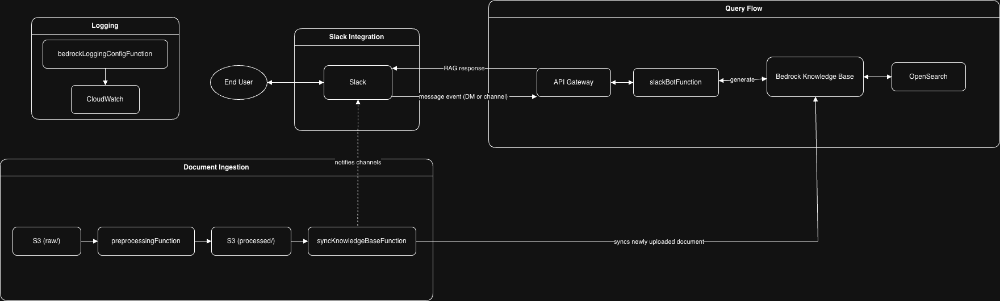

# EPS Assist Me


EPS Assist Me is a Slack-based AI assistant that answers questions about onboarding to and implementation of the NHS Electronic Prescription Service (EPS) APIs.
It uses Amazon Bedrock Knowledge Base for RAG to search relevant documentation and generate responses based off it.

## What This Is

An AI assistant deployed as a set of AWS Lambda functions behind a Slack integration.
Users ask questions in Slack. The bot retrieves relevant content from a knowledge base and responds.

The knowledge base is populated by uploading documents to S3.
Documents are automatically converted, ingested, and made searchable.

## Architecture Overview



Four Lambda functions deployed via a single CDK stack. Responsibilities are strictly separated between Slack event handling, document conversion, automated ingestion, and Bedrock logging which is a standalone function, created to toggle logging on and off as needed.

## Project Structure

- `packages/cdk/` CDK infrastructure, as a single stack containing all resources required for the secure functioning of the bot. Includes Bedrock prompt templates in `prompts/` directory.
- `packages/slackBotFunction/` Handles Slack events - mentions, DMs, threads, and user feedback. It queries Bedrock to retrieve relevant content and generate responses.
- `packages/preprocessingFunction/` Converts uploaded documents (PDF, DOCX, etc.) to Markdown for ingestion.
- `packages/syncKnowledgeBaseFunction/` Triggers knowledge base ingestion when processed documents land in S3. Notifies Slack when ingestion starts.
- `packages/bedrockLoggingConfigFunction/` CloudFormation custom resource for Bedrock model invocation logging.
- `packages/sample_docs/` Test documents. Not for real usage.
- `scripts/` Developer utilities (doc sync, regression tests).
- `.devcontainer` Dockerfile and VS Code devcontainer definition.
- `.github` CI/CD workflows, actions, and scripts.
- `.vscode` Workspace file.

## Running Locally

Use VS Code with a devcontainer. It installs all required tools and correct versions.
See [devcontainer docs](https://code.visualstudio.com/docs/devcontainers/containers) for host setup.

```bash
# install everything
make install

# configure AWS SSO (first time only)
make aws-configure
# region: eu-west-2, use hscic credentials, select dev account

# verify CDK compiles
make cdk-synth

# run all tests
make test

# deploy
STACK_NAME=your-stack-name make cdk-deploy
```

Token expired? `make aws-login`

All commits must be made using [signed commits](https://docs.github.com/en/authentication/managing-commit-signature-verification/signing-commits)

Once the steps at the link above have been completed. Add to your ~/.gnupg/gpg.conf as below:

```
use-agent
pinentry-mode loopback
```

and to your ~/.gnupg/gpg-agent.conf as below:

```
allow-loopback-pinentry
```

As described here:
https://stackoverflow.com/a/59170001

You will need to create the files, if they do not already exist.
This will ensure that your VSCode bash terminal prompts you for your GPG key password.

You can cache the gpg key passphrase by following instructions at https://superuser.com/questions/624343/keep-gnupg-credentials-cached-for-entire-user-session

## Environment Variables

Required for deployment:

| Variable | Purpose |
|---|---|
| `STACK_NAME` | CloudFormation stack name |
| `ACCOUNT_ID` | AWS Account ID |
| `VERSION_NUMBER` | Deployment version |
| `COMMIT_ID` | Git commit ID |
| `LOG_RETENTION_IN_DAYS` | CloudWatch log retention period |
| `SLACK_BOT_TOKEN` | Slack bot OAuth token |
| `SLACK_SIGNING_SECRET` | Slack app signing secret |

## Make Commands

| Command | What it does |
|---|---|
| `make install` | Install all dependencies (Node, Python, pre-commit hooks) |
| `make test` | Run unit tests for all Lambda functions |
| `make lint` | Run all linters (Black, Flake8, ESLint, actionlint, ShellCheck) |
| `make cdk-synth` | Synthesise CDK to CloudFormation templates |
| `make cdk-deploy` | Build and deploy to AWS (requires `STACK_NAME`) |
| `make cdk-diff` | Compare deployed stack with local CDK code |
| `make cdk-watch` | Live-sync code and CDK changes to AWS |
| `make sync-docs` | Sync sample docs to S3 for a PR stack |
| `make convert-docs` | Convert all documents in `raw_docs/` to Markdown locally |
| `make convert-docs-file` | Convert a single file. Usage: `FILE=doc.pdf make convert-docs-file` |
| `make clean` | Remove build artifacts and test coverage |
| `make deep-clean` | Clean + remove `node_modules` and `.venv` |

## CI Setup

GitHub Actions require a repo secret called `SONAR_TOKEN`.
Get it from [SonarCloud](https://sonarcloud.io/) - you need "Execute Analysis" permission on `NHSDigital_eps-assist-me`.

Pre-commit hooks are installed via `make install-hooks` and configured in `.pre-commit-config.yaml`.
Same checks run in CI.

## GitHub Folder

- `dependabot.yml` Dependabot definition.
- `pull_request_template.md` PR template.

Actions:

- `mark_jira_released` Marks Jira issues as released.
- `sync_documents` Syncs documents to S3 for knowledge base ingestion.
- `update_confluence_jira` Updates Confluence with Jira issues.

Scripts:

- `call_mark_jira_released.sh` Calls Lambda to mark Jira issues released.
- `check-sbom-issues-against-ignores.sh` Validates SBOM scan against ignore list.
- `create_env_release_notes.sh` Generates environment release notes.
- `create_int_rc_release_notes.sh` Creates integration release candidate notes.
- `delete_stacks.sh` Deletes CloudFormation stacks for closed PRs.
- `find_s3_bucket.sh` Finds S3 bucket for a CloudFormation stack.
- `fix_cdk_json.sh` Updates `cdk.json` context values before deployment.
- `get_current_dev_tag.sh` Gets current dev tag.
- `get_target_deployed_tag.sh` Gets currently deployed tag.

Workflows:

- `ci.yml` Merge to main. Deploys to DEV and QA after quality checks.
- `pull_request.yml` PR opened/updated. Packages and deploys to dev account.
- `release.yml` On-demand release to INT and PROD with manual approval.
- `release_all_stacks.yml` Reusable deployment workflow with environment-specific config.
- `cdk_package_code.yml` Packages code into Docker image as GitHub artifact.
- `create_release_notes.yml` Generates deployment release notes.
- `delete_old_cloudformation_stacks.yml` Daily cleanup of old stacks.
- `run_regression_tests.yml` Runs regression tests against a deployed stack.

## Contributing

Contributions to this project are welcome from anyone, providing that they conform to the [contribution guidelines](https://github.com/NHSDigital/eps-assist-me/blob/main/CONTRIBUTING.md) and [code of conduct](https://github.com/NHSDigital/eps-assist-me/blob/main/CODE_OF_CONDUCT.md).

### Licensing

This code is dual licensed under the MIT license and the OGL (Open Government License).Any new work added to this repository must conform to the conditions of these licenses. In particular this means that this project may not depend on GPL-licensed or AGPL-licensed libraries, as these would violate the terms of those libraries' licenses.

The contents of this repository are protected by Crown Copyright (C).
