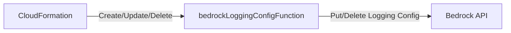

# Bedrock Logging Config Function

CloudFormation custom resource Lambda that configures Bedrock model invocation logging to CloudWatch.

## What This Is

A bridge resource.
AWS CloudFormation currently has no native resource type for configuring Bedrock logging. This Lambda bridges that gap by using the Bedrock API directly during stack deployment/update/deletion.

## What This Is Not

- Not a runtime dependency - it only executes during CDK/CloudFormation deployments
- Not the log consumer - it only tells Bedrock *where* to send logs

## Architecture Overview

## Environment Variables

Configured by CDK based on stack parameters.

| Variable | Purpose |
|---|---|
| `ENABLE_LOGGING` | Toggle for enabling/disabling logs (`true` or `false`) |
| `CLOUDWATCH_LOG_GROUP_NAME` | Destination CloudWatch Log Group |
| `CLOUDWATCH_ROLE_ARN` | IAM Role allowing Bedrock to write to CloudWatch |

## Known Constraints

- It affects the Bedrock logging configuration for the *entire AWS region/account* where deployed. If another stack tries to modify Bedrock logging in the same account/region, they will overwrite each other.
