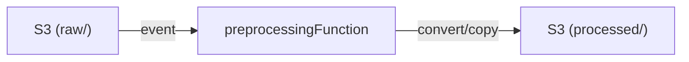

# Preprocessing Function

Lambda that converts raw uploaded documents into Markdown format for Bedrock Knowledge Base ingestion.
Runs sequentially when new documents land in the raw S3 bucket prefix.

## What This Is

A document standardisation step.
Converts `.pdf`, `.doc`, `.docx`, `.xls`, `.xlsx`, and `.csv` files into `.md`.
Passes through `.txt`, `.md`, `.html`, and `.json` files untouched.

Output is written to the processed S3 bucket prefix, ready for ingestion.

## Architecture Overview



Downloads from `raw/`, converts to Markdown locally (in a secure temp directory), and uploads to `processed/`.

## Project Structure

- `app/handler.py` Lambda entry point. Processes S3 records.
- `app/config/config.py` Configuration and environment variables.
- `app/services/` Conversion logic (`converter.py`) and S3 helpers (`s3_client.py`).
- `app/cli.py` Local CLI wrapper for convert-docs.
- `tests/` Unit tests.

## Environment Variables

Set by CDK.

| Variable | Purpose |
|---|---|
| `DOCS_BUCKET_NAME` | S3 bucket containing the documents |
| `RAW_PREFIX` | Prefix where raw uploads land (e.g. `raw/`) |
| `PROCESSED_PREFIX` | Prefix where Markdown output goes (e.g. `processed/`) |
| `AWS_ACCOUNT_ID` | AWS Account ID |

## Running Tests

```bash
cd packages/preprocessingFunction
PYTHONPATH=. poetry run python -m pytest
```

Or from the repo root:

```bash
make test
```

## Known Constraints

- Complex PDFs (heavy formatting, multi-column layouts) may produce imperfect Markdown
- Runs sequentially per uploaded file - large batch uploads may take time to process
