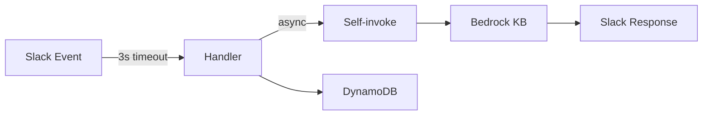

# Slack Bot Function

Lambda that handles all Slack interactions for the EPS Assist Me bot.
Receives events from Slack, queries Bedrock Knowledge Base, returns AI-generated responses.

## What This Is

The core bot logic. Handles:

- `@mentions` in public channels
- direct messages
- thread follow-ups (no re-mention needed)
- feedback (Yes/No buttons and `feedback:` text prefix)

One Lambda. Uses a self-invoking async pattern to handle heavy processing while still acknowledging Slack's 3-second response timeout.

## What This Is Not

- Not the infrastructure - that's in `packages/cdk/`
- Not the document ingestion pipeline - that's `preprocessingFunction` and `syncKnowledgeBaseFunction`
- Not the upload notifier - that's `notifyS3UploadFunction`

## Architecture Overview



- **Slack Bolt** for event handling
- **Bedrock Knowledge Base** for RAG responses with guardrails
- **DynamoDB** for session state and feedback storage

## Project Structure

- `app/handler.py` Lambda entry point.
- `app/core/` Configuration and environment variables.
- `app/services/` Business logic - Bedrock client, DynamoDB, Slack client, prompt loading, AI processing.
- `app/slack/` Event handlers - mentions, DMs, threads, feedback.
- `app/utils/` Shared utilities.
- `tests/` Unit tests.

## Environment Variables

Set by CDK. Don't hardcode these.

| Variable | Purpose |
|---|---|
| `SLACK_BOT_TOKEN_PARAMETER` | Parameter Store path for bot token |
| `SLACK_SIGNING_SECRET_PARAMETER` | Parameter Store path for signing secret |
| `SLACK_BOT_STATE_TABLE` | DynamoDB table name |
| `KNOWLEDGEBASE_ID` | Bedrock Knowledge Base ID |
| `RAG_MODEL_ID` | Bedrock model ARN |
| `GUARD_RAIL_ID` | Bedrock guardrail ID |

## Running Tests

```bash
cd packages/slackBotFunction
PYTHONPATH=. poetry run python -m pytest
```

Or from the repo root:

```bash
make test
```

## Known Constraints

- Slack enforces a 3-second response window. A quick acknowledgement is required, but how the subsequent background processing is handled (like the async self-invoke pattern) is an architectural choice.
- Bedrock guardrails can block legitimate queries if they hit content filters - check CloudWatch logs
- Session state lives in DynamoDB with TTLs - conversations expire after 30 days
