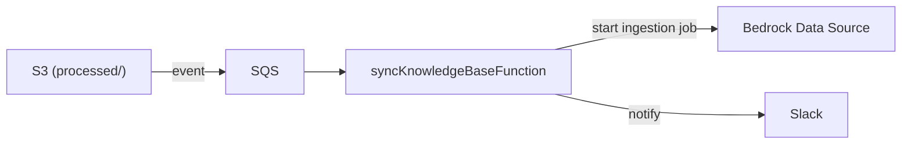

# Sync Knowledge Base Function

Lambda that automatically triggers Bedrock Knowledge Base ingestion when new documents are ready.
Ensures the AI assistant has access to the latest documentation.

## What This Is

The ingestion trigger.
Listens for S3 events from the `processed/` prefix (via SQS). Once a batch of converted documents lands, it starts a Bedrock Data Source ingestion job.

It also notifies Slack that ingestion has started.

## Architecture Overview

Batch processing via SQS prevents overwhelming the Bedrock API with multiple parallel ingestion jobs.

## Project Structure

- `app/handler.py` Lambda entry point. Processes SSQS/S3 records.
- `app/config/` Configuration and environment variables.

## Environment Variables

Set by CDK.

| Variable | Purpose |
|---|---|
| `KNOWLEDGEBASE_ID` | Target Bedrock Knowledge Base ID |
| `DATA_SOURCE_ID` | Target Bedrock Data Source ID |

## Known Constraints

- If an ingestion job is already running, Bedrock returns a `ConflictException`. The lambda catches this and handles it safely, usually letting subsequent retries succeed when the first job finishes.
- Only file types supported by Bedrock (`.pdf`, `.txt`, `.md`, `.csv`, `.docx`, etc.) trigger ingestion.
